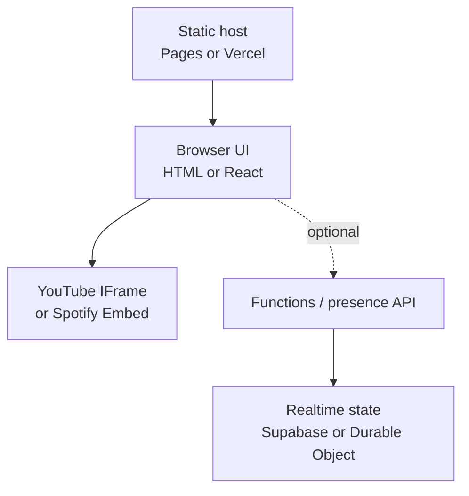

# Technical report: Indian nostalgia music web apps

**Prepared:** 15 August 2026  
**Scope:** 30 unique sites from the supplied list (three repeated entries were deduplicated).  
**Method:** live-page, response-header, JavaScript-bundle, asset, and network-endpoint inspection. This is a black-box implementation review, not a source-code or infrastructure audit. “No backend observed” means the inspected public client did not require an application API for its main experience; it does not prove that no private build or operational service exists.

## Executive conclusion

These apps are visually elaborate but technically simple. The recurring architecture is:

- a static page or client-rendered React app;
- a YouTube IFrame player using hard-coded video or playlist IDs;
- local images, animation, horns, ambience, or sound effects;
- optional outbound Spotify and YouTube Music links;
- occasionally, a tiny API or realtime database for a genuine listener count.

**A server backend is not required for the core product.** A public or unlisted YouTube/YouTube Music playlist can play directly in the browser. Spotify also supports browser embeds. A backend becomes useful only for features such as real concurrent listener counts, synchronized rooms, accounts, likes, chat, moderation, private catalog administration, or protected third-party credentials.

For a new version of this concept, the most sensible starting point is **plain HTML/CSS/JavaScript + the YouTube IFrame Player API + Cloudflare Pages**. GitHub Pages is equally capable of the core experience and is the simplest choice when the project already lives in GitHub. Use Vercel when the implementation genuinely benefits from Next.js or server functions—not merely because many examples use a free `.vercel.app` address.



## Site-by-site technical findings

In the final column, **No** means no server is needed for playback and none was observed in the public client. **Optional extra** means the music player remains static, but an ancillary feature makes a network call. **Yes** means the currently presented experience uses backend/realtime behavior.

| App | Observed frontend | Delivery observed | Music source | Server-backend verdict |
|---|---|---|---|---|
| [saloon.wtf](https://saloon.wtf) | Next.js + React | Cloudflare edge; origin not established | YouTube IFrame playback; iTunes preview/metadata URLs also present; Spotify and YouTube Music outbound links | **No** for playback; no app API observed |
| [truckplaylist.wtf](https://truckplaylist.wtf) | Single vanilla HTML/CSS/JS page | Vercel | Hard-coded YouTube video IDs through the IFrame API; active YouTube Music playlist link | **No** |
| [hornokplease.xyz](https://hornokplease.xyz) | Vanilla HTML/CSS/JS; JSON track list | Vercel | YouTube IFrame; locally hosted horn sound effect | **No**; code comments identify the listener count as decorative |
| [safar-e-up.vercel.app](https://safar-e-up.vercel.app) | Vite + React | Vercel | YouTube IFrame player | **No** |
| [marathi-songs.vercel.app](https://marathi-songs.vercel.app) | Vanilla HTML/CSS/JS | Vercel | YouTube IFrame; Spotify and YouTube Music links | **No**; client code explicitly implements a fake online counter |
| [madrasradio.vercel.app](https://madrasradio.vercel.app) | Next.js + React | Vercel | Embedded YouTube playlists by mood; Spotify playlist links | **No** |
| [kannada2000s.vercel.app](https://kannada2000s.vercel.app) | Next.js + React | Vercel | YouTube playlist player | **No** |
| [naada-blr.vercel.app](https://naada-blr.vercel.app) | Vanilla HTML/CSS/JS | Vercel | YouTube IFrame; Spotify and YouTube Music links | **Optional extra:** `/api/presence` supplies a live count; playback itself is static |
| [sindhi-lada.vercel.app](https://sindhi-lada.vercel.app) | Vanilla HTML/CSS/JS | Vercel | YouTube/YouTube Music playlist via IFrame API | **No**; displayed listener number is generated locally |
| [gediroute.vercel.app](https://gediroute.vercel.app) | Astro shell + React island | Vercel | YouTube IFrame with individual video IDs | **No** |
| [bihar-parivahan-nigam.vercel.app](https://bihar-parivahan-nigam.vercel.app) | Next.js + React | Vercel | YouTube playlist/player | **No**; no live-count endpoint observed |
| [chacharchok.vercel.app](https://chacharchok.vercel.app) | Next.js + React | Vercel | YouTube IFrame; Spotify outbound links | **No** |
| [mazdoor-radio.vercel.app](https://mazdoor-radio.vercel.app) | Next.js + React | Vercel | Hard-coded YouTube IDs; YouTube search fallback | **Yes for extras:** `/api/presence` and `/api/youtube/search`; hard-coded playback does not intrinsically need them |
| [chaitapri.vercel.app](https://chaitapri.vercel.app) | Next.js + React | Vercel | Spotify playlist iframe and Spotify link | **No** |
| [chaiwala.live](https://chaiwala.live) | Vite + React | Vercel | YouTube Music playlist through IFrame API; local chai ambience | **No** |
| [busdriver.wtf](https://busdriver.wtf) | Next.js + React | Cloudflare edge; origin not established | YouTube IFrame with playlist IDs | **Yes:** WebSocket endpoint at `/api/listeners` for concurrent listeners |
| [roadways-wala.ai.studio](https://roadways-wala.ai.studio) | Vite + React | Google Frontend / AI Studio | YouTube playlist iframe | **No** |
| [construction-site-lac.vercel.app](https://construction-site-lac.vercel.app) | Next.js + React | Vercel | YouTube playlist/player; local effects | **Yes for presence:** Supabase Realtime client; playback remains browser-only |
| [auto-wala.vercel.app](https://auto-wala.vercel.app) | Vanilla HTML/CSS/JS; JSON track list | Vercel | YouTube IFrame; local horn MP3s | **No** |
| [pan-wala.vercel.app](https://pan-wala.vercel.app) | Vanilla HTML/CSS/JS | Vercel | YouTube IFrame; Spotify outbound link | **No**; third-party analytics/ads only |
| [deluxesaloon.space](https://deluxesaloon.space) | Next.js + React | Cloudflare edge; origin not established | YouTube/YouTube-nocookie embeds; Spotify and YouTube Music links | **No**; no app API observed |
| [apnadhaba.com](https://apnadhaba.com) | Vanilla inline HTML/CSS/JS | `hcdn` edge; provider not conclusively established | YouTube IFrame; Google Tag Manager | **No** |
| [mehfil-eosin.vercel.app](https://mehfil-eosin.vercel.app) | Next.js + React | Vercel | YouTube playback; Spotify and YouTube Music links | **No** |
| [gali-fm.vercel.app](https://gali-fm.vercel.app) | Vanilla ES-module HTML/CSS/JS | Vercel | YouTube playlist; local ambient MP3s | **Optional external services:** Firebase Analytics and an external visitor counter; no own playback backend observed |
| [musafir.vercel.app](https://musafir.vercel.app) | Vite-built vanilla JS/TypeScript | Vercel | YouTube playlist/video IDs; local horn/ambience asset | **No** |
| [90s-toon.vercel.app](https://90s-toon.vercel.app) | Vanilla HTML/CSS/JS | Vercel | YouTube iframe embeds | **No** |
| [wohdin.xyz](https://wohdin.xyz) | Next.js + React | Vercel | YouTube IFrame API | **No**; no live-count endpoint observed |
| [chai-tapri-nine.vercel.app](https://chai-tapri-nine.vercel.app) | Vite + React | Vercel | Hard-coded YouTube video IDs | **No** |
| [cutting-chai-xi.vercel.app](https://cutting-chai-xi.vercel.app) | Vanilla HTML/CSS/JS; JSON track list | Vercel | YouTube IFrame | **No** |
| [hornokplease-delta.vercel.app](https://hornokplease-delta.vercel.app) | Single static HTML/CSS/JS page | Vercel | YouTube IFrame | **No** |

### What the matrix says

- **YouTube is the de facto audio layer.** Twenty-nine of the 30 sites use YouTube playback. The exception found was `chaitapri`, which uses a Spotify embed.
- **Spotify is usually a destination link, not the player.** It gives users a way to open or save the collection in Spotify while the site itself keeps the more controllable YouTube player.
- **The apps do not generally host the songs.** Locally hosted audio is mostly horns, traffic, chai-shop ambience, or another short effect. That is technically and legally different from serving a catalogue of commercial recordings.
- **Framework complexity is unrelated to the essential feature.** The same product appears as one HTML file, Vite/React, Astro/React, and Next.js. React helps manage a rich interactive scene, but it is not required to play a playlist.
- **“12 people listening” is not evidence of a backend.** Several counters are visibly generated in the client. Only `naada-blr`, `mazdoor-radio`, `busdriver`, and `construction-site-lac` exposed a presence/API/realtime mechanism during inspection.

## Does this product need a server backend?

### No backend needed

A completely static build can provide:

- the illustrated scene and animations;
- play/pause, next/previous, volume, shuffle, and playlist traversal through the YouTube IFrame API;
- a Spotify playlist embed;
- local UI preferences using `localStorage`;
- horns and ambience stored as site assets;
- analytics from a third-party script;
- deployment to GitHub Pages, Cloudflare Pages, or Vercel.

The browser talks directly to YouTube or Spotify. There is no need to proxy the stream, store the songs, or run a database.

### Backend justified

Use a small server/API only when the feature requires shared or protected state:

| Feature | Why a backend is needed | Lightweight implementation |
|---|---|---|
| Real concurrent listener count | Browsers must register presence and expire disconnected users | Cloudflare Durable Object, Supabase Realtime, or a WebSocket/presence function |
| Synchronized “radio room” | One shared track position must be authoritative | Durable Object/WebSocket room or realtime database |
| Accounts, likes, history | Durable per-user storage and authentication | Managed auth + database |
| Chat or requests | Shared state, moderation, abuse controls | Realtime backend plus rate limiting |
| Search or catalogue administration | The app may need API quotas, caching, or a protected secret | Serverless function with secret stored server-side |
| Private Spotify functionality | OAuth tokens and refresh flows need careful handling | Server-side OAuth/token exchange |

Do not add a server solely to display a decorative number. Either label it as part of the fiction (“the shop feels busy tonight”) or omit it; presenting random values as live telemetry is misleading.

## Hosting comparison

All three services can host the essential static version and attach a custom domain with HTTPS. A custom domain is purchased separately; their free addresses are typically `project.vercel.app`, `project.pages.dev`, and `account.github.io/project`.

| Capability | Vercel | Cloudflare Pages | GitHub Pages |
|---|---|---|---|
| Best fit | Next.js, React deployments, preview environments, serverless APIs | Static/Vite/React sites with a strong edge network and optional Workers/Functions | Straightforward static sites published from a GitHub repository |
| Static HTML/CSS/JS | Yes | Yes | Yes |
| Build from Git | Yes; preview deployments are first-class | Yes; branch/preview deployments are first-class | Yes through Pages/Actions; PR previews are not a comparable default product feature |
| Backend option | Vercel Functions; current platform also documents WebSocket support | Pages Functions on Workers; Durable Objects are a strong fit for stateful realtime rooms | None in Pages; call an external backend |
| Next.js experience | Strongest and most native | Static export is easy; full server-rendered Next.js generally needs the Cloudflare Workers/OpenNext route | Static export only |
| Realtime presence | Possible, but introduces server/state architecture | Particularly suitable with Workers + Durable Objects | Requires Supabase, Firebase, or another external service |
| Free-plan caveat | Hobby is for personal, non-commercial use; check plan terms before monetising | Static asset requests are free/unlimited; Functions consume Workers quotas; build/file limits apply | Static-service limits apply; GitHub says Pages is not intended to run an online business or SaaS |
| Operational overhead | Low, especially for Next.js | Low for static sites; modest when adding Workers state | Lowest for a purely static repo |

Relevant current documentation: [Vercel Hobby terms](https://vercel.com/docs/plans/hobby), [Vercel deployments and previews](https://vercel.com/docs/deployments), [Vercel Functions](https://vercel.com/docs/functions), [Vercel WebSockets](https://vercel.com/docs/functions/websockets), [Cloudflare Pages limits](https://developers.cloudflare.com/pages/platform/limits/), [Pages Functions](https://developers.cloudflare.com/pages/functions/), [Pages Functions pricing](https://developers.cloudflare.com/pages/functions/pricing/), [Cloudflare Durable Object WebSockets](https://developers.cloudflare.com/durable-objects/best-practices/websockets/), [what GitHub Pages is](https://docs.github.com/en/pages/getting-started-with-github-pages/what-is-github-pages), and [GitHub Pages limits](https://docs.github.com/en/pages/getting-started-with-github-pages/github-pages-limits).

### Practical choice

1. **Cloudflare Pages — recommended default.** It offers the static simplicity of GitHub Pages, useful preview deployments, and a clean upgrade path to Functions or Durable Objects if genuine realtime presence is later added.
2. **GitHub Pages — recommended if the site is already a simple public GitHub project.** It is sufficient for the entire music experience. Do not migrate merely to get a YouTube player.
3. **Vercel — recommended when choosing Next.js or needing its deployment/server-function workflow.** It is excellent at that job, but a one-page nostalgia radio does not intrinsically need Next.js, and commercial use requires attention to the plan terms.

Hosting limits and plan terms change, so they should be rechecked before launch or monetisation.

## Music source: YouTube vs YouTube Music vs Spotify

### YouTube and YouTube Music

YouTube Music playlists use the same underlying playlist-ID model as YouTube. In a URL such as:

```text
https://music.youtube.com/playlist?list=PLxxxxxxxx
```

the reusable identifier is everything after `list=`. If the playlist is public or unlisted, it can usually be embedded directly:

```html
<iframe
  width="480"
  height="270"
  src="https://www.youtube.com/embed?listType=playlist&list=PLxxxxxxxx"
  title="Nostalgia playlist"
  allow="autoplay; encrypted-media; picture-in-picture"
  allowfullscreen>
</iframe>
```

For custom buttons and track events, use the [YouTube IFrame Player API](https://developers.google.com/youtube/iframe_api_reference) with `listType: "playlist"` and the playlist ID. Merely playing the playlist does **not** require the YouTube Data API, an API key, or a backend. The [player parameter documentation](https://developers.google.com/youtube/player_parameters) gives the official embed format.

Limitations:

- private playlists cannot be treated as anonymous public embeds;
- unavailable, region-blocked, age-restricted, or embedding-disabled videos may be skipped—YouTube notes that an [embedded playlist can omit videos whose owners disabled embedding](https://support.google.com/youtube/answer/57793);
- browsers commonly block audible autoplay until a user gesture;
- a playlist can change later, so the site is not a permanent archival copy;
- the implementation must comply with [YouTube API Services policies](https://developers.google.com/youtube/terms/developer-policies).

### Spotify

A public Spotify playlist can be added with a [Spotify Embed](https://developer.spotify.com/documentation/embeds) without building a custom audio backend. Spotify’s [embed tutorial](https://developer.spotify.com/documentation/embeds/tutorials/creating-an-embed) and [IFrame API](https://developer.spotify.com/documentation/embeds/tutorials/using-the-iframe-api) cover the standard widget and limited programmatic control.

The [Spotify Web Playback SDK](https://developer.spotify.com/documentation/web-playback-sdk) is a different, much heavier choice: it provides custom playback but requires Spotify authorization, a Premium user for Web Playback, token handling, and compliance with Spotify’s platform restrictions. Spotify also tightened development access in 2026: development-mode apps are limited to a Premium owner, one Client ID, and up to five authorized users, according to its [developer-access update](https://developer.spotify.com/blog/2026-02-06-update-on-developer-access-and-platform-security). That makes it a poor foundation for a casual public microsite unless the product truly needs Spotify-native playback.

### Can an existing YouTube/YouTube Music playlist be reused?

**Yes—directly, and that is the recommended route.** Make the playlist public or unlisted, copy its `list=` ID, and use the YouTube playlist embed or IFrame Player API. No playlist migration is needed.

Spotify cannot directly play a YouTube playlist. To offer the same collection in Spotify, recreate it there or use a playlist-transfer service to match tracks, then embed or link the resulting Spotify playlist. Matching is imperfect because catalogues, editions, remasters, and regional availability differ.

For this particular genre of experience, YouTube is the better primary source:

- the playlist already exists there;
- rare regional songs, television themes, and older uploads are often easier to find;
- it supports playlist playback and custom site controls without user login;
- almost the entire inspected peer set already uses the same architecture.

Spotify is best retained as an optional “Open in Spotify” link or standard embed for users who prefer its library.

## Recommended implementation

### Version 1: static, no backend

```text
site/
├── index.html
├── styles.css
├── player.js
├── assets/
│   ├── scene.webp
│   ├── horn.mp3
│   └── ambience.mp3
└── README.md
```

Use plain JavaScript unless the interface contains enough independent state—animated characters, scene modes, queue editing, responsive panels—to make React materially easier to maintain. Keep playlist IDs in a small configuration object. Deploy to Cloudflare Pages or GitHub Pages.

### Version 2: add only proven features

- Add privacy-friendly analytics if there is a concrete measurement question.
- Add a presence service only when “people listening now” is meant to be real.
- Add Next.js/server functions only when there is actual server behavior.
- Keep songs on YouTube or Spotify; locally host only original/licensed scene audio and effects.

### Compliance and UX cautions

- Do not download and re-host commercial songs without the necessary rights.
- Do not copy the tiny hidden-player technique visible in some examples. YouTube’s player documentation says embedded players must have a viewport of at least **200 × 200 pixels**. Provide a compliant visible player surface, even if the rest of the experience uses custom controls.
- Start audio after a clear user action and provide pause, volume, and mute controls.
- Provide fallback links to the original playlist when a browser blocks playback.
- Treat title/artist metadata as display data, not ownership evidence.

## Bottom line

The winning implementation is not a media-streaming platform. It is a static interactive scene wrapped around an official third-party player. Start with **HTML/CSS/JavaScript, a reusable YouTube Music playlist ID, and Cloudflare Pages or GitHub Pages**. Introduce a backend only for a feature that genuinely requires shared state. That keeps the site inexpensive, fast, portable, and much easier to maintain.
